# nyaweria

```mermaid
---
title: Service Architecture
---
architecture-beta
    group api(ant-design:console-sql-outlined)[API]

    service db(logos:aws-aurora)[Database] in api
    service disk1(logos:aws-glacier)[Storage] in api
    service disk2(logos:aws-s3)[Storage] in api
    service server(logos:aws-ec2)[Server] in api

    db:L -- R:server
    disk1:T -- B:server
    disk2:T -- B:db
```




Saweria clone project to learn bidirection communication between client and server

Youtube: <https://www.youtube.com/live/8Qp_SLd6MBQ?si=ZU-12e87PRCRDAEm>

## Onboarding and Development Guide

### Prerequisite

1. [Visual Studio Code](https://code.visualstudio.com/) with [Dev Containers](https://marketplace.visualstudio.com/items?itemName=ms-vscode-remote.remote-containers) extension
2. [Docker](https://www.docker.com/get-started/) or [Podman](https://podman.io/docs/installation)

### Setup Local Development

1. clone repository

```shell
git clone git@github.com:bickyeric/nyaweria.git
```

2. open with vscode

```shell
code nyaweria
```

3. run the `Dev Containers: Reopen in Container` command from the vscode Command Palette (`F1`)
